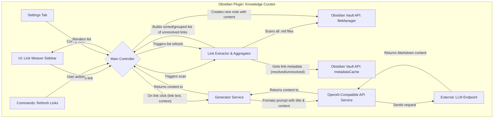

# Obsidian Knowledge Curator (知识策展人)

“Knowledge Curator” (知识策展人) 是一个 Obsidian 插件，它作为一个**链接驱动的知识图谱扩展工具**。它会扫描您 Vault 中所有笔记里的 `[[]]` 链接，识别出那些指向尚不存在的文件的“悬空链接”，并以智能排序的方式呈现给您。您只需选择一个悬空链接，插件就会自动为其创建对应的文件，并调用 AI 填充内容，从而帮助您有机地扩展知识网络。

## 核心理念与工作流

1.  **扫描 (Scan):** 插件启动或用户手动刷新时，遍历 Vault 中所有 `.md` 文件，解析出每一个 `[[]]` 链接。
2.  **识别 (Identify):** 对于每一个解析出的链接，利用 Obsidian 的 API 检查其是否指向一个已存在的文件。所有指向不存在文件的链接都被识别为“悬空链接”。
3.  **聚合与排序 (Aggregate & Sort):**
    -   对所有悬空链接进行聚合统计。
    -   按照用户选择的排序逻辑进行排序：
        -   **按频次 (Frequency):** 被引用次数最多的悬空链接排在最前。
        -   **按字母顺序 (Alphabetical):** 从 A 到 Z 排序。
4.  **展示 (Display):** 在专属的侧边栏中，以一个清晰的列表（或按文件夹分组的列表）展示所有排序后的悬空链接。
5.  **选择与创建 (Select & Create):** 用户在列表中点击一个悬空链接。插件会立即以该链接的名称为标题，在用户指定的默认位置创建一个新的 `.md` 文件。
6.  **填充 (Populate):** 以该标题为关键词，使用预设模板调用 OpenAI-compatible 接口，生成内容并填充到新创建的文件中。如果启用了上下文感知生成，还会收集引用了该链接的其他笔记的上下文。
7.  **刷新 (Refresh):** 操作完成后，侧边栏列表自动刷新，刚刚被处理的链接从“悬空链接”列表中消失。

## 关键功能与特性

1.  **悬空链接浏览器 (Unresolved Link Explorer):**

    -   插件的核心 UI，一个专属的侧边栏视图。
    -   **主视图:** 一个可排序、可过滤、可分组的列表，展示所有悬空链接。
    -   **每项信息:** 列表中的每一项都包含关键信息，如：
        -   **链接名称:** `[[数字利维坦]]`
        -   **引用频次:** `(被引用 5 次)`
        -   **来源文件:** 点击 `...` 按钮可查看所有引用了该链接的源文件路径。

2.  **强大的排序与分组功能 (Advanced Sorting & Grouping):**

    -   侧边栏顶部提供下拉菜单，让用户可以动态切换视图：
        -   **排序方式:**
            -   `按引用频次` (默认): 最能体现当前知识网络中“最需要被定义”的概念。
            -   `按字母顺序` (A-Z)。
        -   **分组方式:**
            -   `无分组 (Flat List)`: 简单的列表。
            -   `按文件夹分组`: 将悬空链接按照它们**首次被引用**的文件的所在文件夹进行分组。这能帮助用户聚焦于特定领域的知识扩展。

3.  **一键定义链接 (One-Click Definition):**

    -   用户在列表中点击任何一个悬空链接。
    -   插件立即执行“创建与填充”工作流。
    -   无需任何确认对话框（因为是创建新文件，没有覆盖风险），追求极致的效率。

4.  **上下文感知生成 (Context-Aware Generation):**

    -   这是一个高级但非常强大的特性。在为悬空链接生成内容时，插件可以**自动收集**引用了该链接的所有笔记的上下文。
    -   **实现方式:**
        1.  当用户点击 `[[数据治理]]` 时，插件找到所有包含此链接的笔记（如 `数字政府.md`, `智慧城市.md`）。
        2.  从这些笔记中提取 `[[数据治理]]` 所在的段落或句子。
        3.  将这些上下文片段注入到 Prompt 中，告诉 AI：“请在以下上下文中定义‘数据治理’：...”。
        4.  这使得生成的内容与现有知识网络的关联性极强，而不是泛泛而谈。
    -   此功能可在设置中开启或关闭。

5.  **模板驱动与纯 OpenAI-Compatible 接口:**
    -   用户可以在设置中指定一个**模板文件路径**。
    -   模板中可以使用 `{{title}}` 和 `{{context_snippets}}` 占位符。
    -   API 设置保持不变，只要求 **Endpoint URL** 和 **API Key**。

## 用户界面与交互 (UI/UX)

1.  **侧边栏视图 (The "Link Weaver" Panel):**

    -   **顶部工具栏:**
        -   **刷新 (Refresh)** 按钮。
        -   **排序方式** 下拉菜单 (`频次`, `A-Z`)。
        -   **分组方式** 下拉菜单 (`无`, `按文件夹`)。
        -   一个 **搜索框**，用于快速过滤悬空链接列表。
    -   **主体区域:**
        -   根据用户的排序/分组选择，展示悬空链接列表。
        -   每个链接条目都是一个可点击的按钮。
        -   点击条目右侧的 `...` 图标，可以展开显示引用了该链接的所有源文件列表，方便用户追溯来源。
    -   **底部状态栏:**
        -   显示总的悬空链接数量。
        -   通过 Obsidian 的 Notice 系统显示当前操作状态，如“正在为 `[[数据治理]]` 生成内容...”、“生成成功！”。

2.  **设置页面 (Settings Tab):**
    -   **API Configuration:** `Endpoint URL`, `API Key`, `Model Name`。
    -   **Template Configuration:** `Template File Path` (支持 `{{title}}` 和 `{{context_snippets}}` 占位符)。
    -   **Generation Configuration:**
        -   `Default Folder for New Notes`: 指定新创建的笔记保存在哪个文件夹。
        -   `Enable Context-Aware Generation`: 一个开关，用于启用/禁用上下文感知功能。

## 技术架构 (Technical Architecture)



-   **`VaultScanner.ts`:** 这是本方案的技术核心。
    -   它需要使用 `this.app.vault.getMarkdownFiles()` 遍历所有文件。
    -   对于每个文件，使用 `this.app.metadataCache.getFileCache(file)?.links` 来获取所有链接。
    -   对于每个链接，使用 `this.app.metadataCache.getFirstLinkpathDest(link.link, file.path)` 来检查其是否为 `null`。如果为 `null`，则为悬空链接。
    -   将所有悬空链接及其来源文件路径聚合到一个数据结构中，进行计数和分组。
-   **`GeneratorService.ts`:** 需要增加一个 `getContextSnippets(linkText)` 方法。这个方法会反向查找所有引用了 `linkText` 的文件，并从这些文件中提取相关段落。
-   **`CuratorView.ts`:** 负责渲染新的链接列表 UI，处理排序、分组、搜索等用户交互，并调用 `GeneratorService` 来完成“一键定义”的流程。
-   **其他模块 (`main.ts`, `ApiService.ts`, `Settings.ts`)** 的职责与之前类似，但处理的数据从“文件状态”变为了“悬空链接列表”。

## 开发与构建

此项目使用 TypeScript 编写，以提供类型检查和更好的代码可维护性。

### 环境要求

-   [Node.js](https://nodejs.org/) (建议版本 >= 16)
-   [Obsidian](https://obsidian.md/) (用于测试插件)

### 快速开始

1.  **克隆此仓库:**
    ```bash
    git clone https://github.com/Larrtroffen/Knowledge-Curator.git
    cd Knowledge-Curator
    ```
2.  **安装依赖:**
    ```bash
    npm install
    ```
3.  **开发模式 (实时编译):**
    ```bash
    npm run dev
    ```
    此命令会监视 `main.ts` 及其他 `.ts` 文件的更改，并自动将它们编译到 `main.js`。
4.  **构建生产版本:**
    ```bash
    npm run build
    ```
    此命令会进行类型检查并编译生成最终的 `main.js`。构建产物将位于 `dist` 文件夹中。

### 在 Obsidian 中手动安装插件

1.  运行 `npm run build`。生成的插件文件 (`main.js`, `manifest.json`, `versions.json`) 将位于 `dist` 文件夹。
2.  在您的 Obsidian Vault 中，创建一个文件夹，路径为 `.obsidian/plugins/knowledge-curator/` (其中 `knowledge-curator` 是 `manifest.json` 中的 `id`)。
3.  将 `dist` 文件夹中的 `main.js`、`manifest.json` 和 `versions.json` 文件复制到该文件夹中。
4.  重启 Obsidian 并在“设置 -> 插件”中启用 “Knowledge Curator”。

## 许可证

本项目采用 MIT 许可证 - 详见 [LICENSE](LICENSE) 文件。
