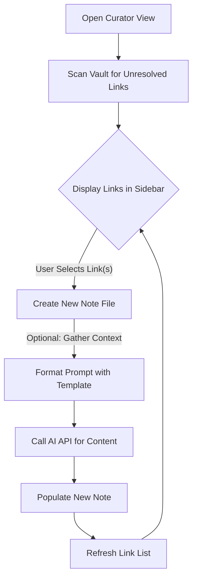

# Obsidian Knowledge Curator (知识策展人)

<a href="https://github.com/Larrtroffen/Knowledge-Curator/releases"></a>
<a href="https://github.com/Larrtroffen/Knowledge-Curator/blob/main/LICENSE"></a>
<a href="https://obsidian.md/"></a>

**Knowledge Curator** (知识策展人) is an Obsidian plugin that acts as a **link-driven knowledge graph extender**. It scans your vault for all `[[wikilinks]]`, identifies "unresolved links" (links that point to non-existent files), and presents them in an intelligently sorted list. With a single click, you can create the corresponding file and use AI to populate it with content, helping you organically grow your knowledge network.

## ✨ Key Features

-   **🔍 Unresolved Link Explorer**: A dedicated sidebar view that lists all your broken links, making it easy to spot gaps in your knowledge base.
-   **🧠 One-Click AI Generation**: Select any unresolved link, and the plugin will automatically create a new note and fill it with AI-generated content based on a template of your choice.
-   **📊 Smart Sorting & Grouping**: Sort links by frequency (most referenced first) or alphabetically. Group them by the folder they were found in to focus on specific areas of your vault.
-   **🔗 Context-Aware Generation**: (Optional) The plugin can gather context from all notes that reference a link, providing the AI with background information for more relevant and specific content.
-   **📝 Template-Driven**: Use your own note templates with `{{title}}` and `{{context_snippets}}` placeholders to define the structure of the generated content.
-   **🌐 Internationalization**: Full support for English and Chinese (中文) interfaces, switchable in the settings.
-   **✅ Batch Operations**: Select multiple links using "Select All" or "Deselect All" buttons and generate content for them in a batch.
-   **🔍 Search & Filter**: Quickly find specific unresolved links using the built-in search bar.
-   **⚙️ Highly Configurable**: Easily configure your AI API endpoint, model, template folder, and other generation preferences.

## 🚀 Getting Started

### Prerequisites

-   [Obsidian](https://obsidian.md/) (version 1.0.0 or higher)
-   An API key for an OpenAI-compatible service (e.g., OpenAI, local LLMs).

### Installation

**From Community Plugins (Recommended when available)**

1.  Go to `Settings` > `Community Plugins`.
2.  Turn on `Community plugins`.
3.  Click `Browse` and search for "Knowledge Curator".
4.  Click `Install` and then `Enable`.

**For Testing (Using BRAT)**

1.  Install the [BRAT](https://github.com/TfTHacker/obsidian42-brat) plugin.
2.  In Obsidian, open the command palette (`Ctrl+P` or `Cmd+P`) and run `BRAT: Add a beta plugin for testing`.
3.  Enter this repository's URL: `https://github.com/Larrtroffen/Knowledge-Curator`.
4.  Enable "Knowledge Curator" in your community plugins list.

**Manual Installation**

1.  Download the latest release from the [Releases page](https://github.com/Larrtroffen/Knowledge-Curator/releases).
2.  Create a folder named `knowledge-curator` in your vault's `.obsidian/plugins/` directory.
3.  Move the downloaded `main.js`, `manifest.json`, and `styles.css` files into the new folder.
4.  Enable "Knowledge Curator" in `Settings` > `Community Plugins`.

### Configuration

1.  Open the "Knowledge Curator" plugin settings.
2.  **API Configuration**:
    -   **API Endpoint URL**: Your OpenAI-compatible API endpoint (e.g., `https://api.openai.com/v1/chat/completions`).
    -   **API Key**: Your secret API key.
    -   **Model Name**: The model to use for generation (e.g., `gpt-4`, `gpt-3.5-turbo`).
3.  **Template Configuration**:
    -   **Template Folder Path**: Path to a folder containing your `.md` template files (e.g., `Templates`). The plugin will list all templates in this folder.
4.  **Generation Configuration**:
    -   **Default Folder for New Notes**: The folder where new notes will be created (e.g., `Inbox`). Leave empty to create in the vault root.
    -   **Enable Context-Aware Generation**: Toggle to gather context from referencing notes.
5.  **Interface**:
    -   **Interface Language**: Choose between `English` and `中文 (Chinese)`.

## 📖 How to Use

1.  **Open the View**: Open the Knowledge Curator view from the Obsidian ribbon or by running the `Open Knowledge Curator view` command.
2.  **Scan for Links**: The plugin automatically scans for unresolved links on load. You can manually refresh using the refresh button in the sidebar.
3.  **Explore Links**: Browse the list of unresolved links. You can sort, group, and search to find the ones you want to address.
4.  **Select & Generate**:
    -   **Single Link**: Click the checkbox next to a link, then click the "Generate Selected" button.
    -   **Multiple Links**: Use the "Select All" button to select all visible links, or manually select multiple checkboxes. Then click "Generate Selected".
5.  **Review & Refine**: The plugin will create the new note and fill it with AI-generated content. The link will disappear from the unresolved list. You can then open the new note and review or edit the content.

## 🏗️ Workflow Diagram



## 🛠️ Development

This project is built with TypeScript and uses ESBuild for bundling.

### Setup

1.  **Clone the repository**:
    ```bash
    git clone https://github.com/Larrtroffen/Knowledge-Curator.git
    cd Knowledge-Curator
    ```
2.  **Install dependencies**:
    ```bash
    npm install
    ```

### Scripts

-   `npm run dev`: Starts the development server, watching for file changes and recompiling.
-   `npm run build`: Compiles TypeScript and bundles the plugin into the `dist` folder.
-   `npm run version`: Bumps the plugin version using `version-bump.mjs`.

### Project Structure

-   `main.ts`: Entry point of the plugin. Handles settings, commands, and view registration.
-   `CuratorView.ts`: Manages the sidebar UI, user interactions, and rendering of the link list.
-   `VaultScanner.ts`: Responsible for scanning the vault and identifying unresolved links.
-   `GeneratorService.ts`: Handles the logic for fetching templates, gathering context, and orchestrating content generation.
-   `ApiService.ts`: A simple service for making API calls to the LLM endpoint.
-   `i18n.ts`: Contains all translation strings for internationalization.

## 🤝 Contributing

Contributions are what make the open-source community such an amazing place to learn, inspire, and create. Any contributions you make are **greatly appreciated**.

If you have a suggestion that would make this better, please fork the repo and create a pull request. You can also simply open an issue with the tag "enhancement". Don't forget to give the project a star! Thanks again!

1.  Fork the Project
2.  Create your Feature Branch (`git checkout -b feature/AmazingFeature`)
3.  Commit your Changes (`git commit -m 'Add some AmazingFeature'`)
4.  Push to the Branch (`git push origin feature/AmazingFeature`)
5.  Open a Pull Request

## 📄 License

Distributed under the MIT License. See `LICENSE` for more information.

## 🙏 Acknowledgments

-   The design and concept were inspired by the need to streamline the process of expanding a personal knowledge base.
-   Thanks to the Obsidian community for providing an excellent platform and API for plugin development.
-   This plugin was built with the help of the [Obsidian Sample Plugin](https://github.com/obsidianmd/obsidian-sample-plugin) template.

---

### 中文介绍 (Chinese Introduction)

**Knowledge Curator** (知识策展人) 是一个 Obsidian 插件，它作为一个**链接驱动的知识图谱扩展工具**。它会扫描您 Vault 中所有笔记里的 `[[]]` 链接，识别出那些指向尚不存在的文件的“悬空链接”，并以智能排序的方式呈现给您。您只需选择一个悬空链接，插件就会自动为其创建对应的文件，并调用 AI 填充内容，从而帮助您有机地扩展知识网络。

#### 核心理念与工作流

1.  **扫描 (Scan):** 插件启动或用户手动刷新时，遍历 Vault 中所有 `.md` 文件，解析出每一个 `[[]]` 链接。
2.  **识别 (Identify):** 对于每一个解析出的链接，利用 Obsidian 的 API 检查其是否指向一个已存在的文件。所有指向不存在文件的链接都被识别为“悬空链接”。
3.  **聚合与排序 (Aggregate & Sort):**
    -   对所有悬空链接进行聚合统计。
    -   按照用户选择的排序逻辑进行排序：
        -   **按频次 (Frequency):** 被引用次数最多的悬空链接排在最前。
        -   **按字母顺序 (Alphabetical):** 从 A 到 Z 排序。
4.  **展示 (Display):** 在专属的侧边栏中，以一个清晰的列表（或按文件夹分组的列表）展示所有排序后的悬空链接。
5.  **选择与创建 (Select & Create):** 用户在列表中选择一个或多个悬空链接。插件会立即以该链接的名称为标题，在用户指定的默认位置创建一个新的 `.md` 文件。
6.  **填充 (Populate):** 以该标题为关键词，使用预设模板调用 OpenAI-compatible 接口，生成内容并填充到新创建的文件中。如果启用了上下文感知生成，还会收集引用了该链接的其他笔记的上下文。
7.  **刷新 (Refresh):** 操作完成后，侧边栏列表自动刷新，刚刚被处理的链接从“悬空链接”列表中消失。

#### 主要功能

-   **悬空链接浏览器**: 在侧边栏中清晰展示所有悬空链接，并可查看其来源文件。
-   **一键定义链接**: 选择链接后，一键即可创建笔记并生成内容，无需确认。
-   **上下文感知生成**: 可选功能，能收集引用链接的笔记上下文，使 AI 生成的内容更贴合您的知识网络。
-   **模板驱动**: 支持自定义模板，使用 `{{title}}` 和 `{{context_snippets}}` 占位符。
-   **多语言界面**: 支持中英文界面切换。
-   **批量操作**: 支持全选/取消全选，并可批量生成多个笔记。
-   **强大的排序与分组**: 可按频次、字母排序，并可按文件夹分组。
